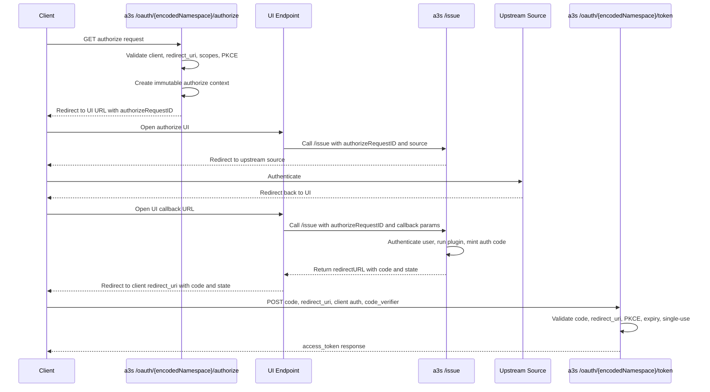

# OAuth Applications Design

## Goal

a3s exposes namespace-scoped OAuth applications so third-party clients can use
a3s as an OAuth 2.0 authorization server for the `authorization_code` grant.

The resulting access token is a standard a3s token.

## Scope

This design is based on:

- the current a3s codebase and its existing `/issue` browser ceremony
- RFC 6749 authorization code flow requirements
- PKCE support for code exchange

## OAuth Engine

a3s implements the OAuth authorization-code flow directly in
`internal/oauthserver`.

The browser flow, `/issue` integration, auth-code session persistence, PKCE
checks, and final a3s token issuance all remain in a3s.

Responsibilities of the OAuth engine:

- validate authorize requests
- validate token requests
- enforce client authentication rules
- enforce redirect URI binding
- enforce PKCE rules
- issue and redeem authorization codes
- expose a small a3s-oriented API to the HTTP layer and `/issue`

## High-Level Architecture

The feature has three layers:

1. `oauthapplication` namespace-scoped configuration object
2. custom OAuth route handlers for authorize/token and related endpoints
3. integration with the existing `/issue` flow for source-driven
   authentication

`/issue` remains the authentication ceremony engine.

OAuth-specific logic remains in the OAuth layer, except that `/issue` may
mint an authorization code instead of an a3s token when invoked with an
authorization context.

## Routes

Routes:

- `GET /oauth/{encodedNamespace}/authorize`
- `POST /oauth/{encodedNamespace}/token`
- `GET /.well-known/oauth-authorization-server/oauth`
- `GET /.well-known/oauth-authorization-server/oauth/{encodedNamespace}`

`encodedNamespace` is a reversible slash-free encoding of the namespace so
it fits in a single path segment - using base64 without padding.

For the root namespace `/`, routes keep dedicated short aliases.

Canonical examples:

- root namespace authorize: `/oauth/authorize`
- root namespace token: `/oauth/token`
- non-root namespace authorize: `/oauth/{encodedNamespace}/authorize`
- non-root namespace token: `/oauth/{encodedNamespace}/token`

The existing `/.well-known/jwks.json` route continues to be used for key
distribution.

## Issuer Model

To preserve compatibility with RFC 8414 discovery in a path-based multi-tenant
deployment, each namespace-scoped OAuth surface has its own issuer.

Canonical issuer examples:

- root namespace issuer: `https://host/oauth`
- non-root namespace issuer: `https://host/oauth/{encodedNamespace}`

The RFC 8414 metadata URL is derived by inserting
`/.well-known/oauth-authorization-server` before the issuer path.

Examples:

- root metadata URL:
  `https://host/.well-known/oauth-authorization-server/oauth`
- non-root metadata URL:
  `https://host/.well-known/oauth-authorization-server/oauth/{encodedNamespace}`

The metadata response `issuer` value exactly matches the issuer used to
derive the metadata URL.

## UI Model

a3s provides a reference UI implementation for the OAuth authorize flow.

That reference UI currently handles:

- collecting source type, source namespace, and source name from the user
- forwarding the authorize context into `/issue`
- receiving the upstream source callback
- calling `/issue` again with callback data and the same authorize context

a3s also supports a configuration option that points to an
external UI endpoint implementing the same browser contract.

The authorize handler builds a UI redirect URL using:

- a local built-in UI endpoint by default
- a configured external UI base endpoint when provided

The backend does not depend on implementation details of the bundled UI.

## Data Model

The design uses two related concepts:

- `oauthapplication`: rich, namespace-scoped app behavior and policy object
- OAuth client registration record: client-specific OAuth metadata stored in a
  separate persistence layer or collection and linked to an
  `oauthapplication`

`oauthapplication` remains the primary admin-managed object in a3s.

Client-specific parameters should not be hardcoded into the application object
for DCR-created clients.

Instead, registered clients reference an `oauthapplication` and carry their own
OAuth client metadata.

## oauthapplication Object

`oauthapplication` is a namespace-scoped object managed through normal a3s CRUD
and import flows.

Minimal intended fields:

- `name`
- `description`
- `namespace`
- `enabled`
- `audience`
- `allowedSources`
- `defaultScopes`

Notes:

- `oauthapplication` defines app behavior, not per-client registration data
- multiple registered clients may reference the same `oauthapplication`

`allowedSources` determines login source selection behavior:

- if `allowedSources` is absent or null, any supported interactive source in
  the namespace is allowed
- if `allowedSources` is present, the selected source matches one of the
  listed Elemental filter expressions evaluated against the resolved source
  object, for example `namespace == /my/ns and name == corp`

A single fixed source is represented as an `allowedSources` list of length one.

## OAuth Client Registration Record

Each concrete OAuth client has its own registration record linked to an
`oauthapplication`.

This record contains client-specific OAuth metadata such as:

- `oauthApplicationID`
- `oauthApplicationNamespace`
- `clientID`
- `clientSecret`
- `redirectURIs`
- `scopes`
- `tokenEndpointAuthMethod`
- optional registration metadata for DCR support

Authorize and token processing work as follows:

- `/authorize` loads the client registration by `client_id`
- validates the requested `redirect_uri` against that client's
  `redirectURIs`
- stores the chosen `redirect_uri` in the authorize context
- binds the authorization code to that exact `redirect_uri`
- `/token` requires the same `redirect_uri` when `redirect_uri` was present on
  the authorize request

Notes:

- `clientSecret` is currently compared directly by the OAuth layer
- v1 supports only `authorization_code`
- v1 supports only `response_type=code`
- the protocol layer supports `client_secret_basic`, `client_secret_post`, and
  `none`
- clients using `none` are public clients
- because only one grant type and one response type are supported in v1, they
  do not need to be stored per client yet
- for DCR, new clients create registration records, not new `oauthapplication`
  objects

Stored object values:

- `tokenEndpointAuthMethod`: `ClientSecretBasic`, `ClientSecretPost`, `None`

## Pending Authorize Context

`/authorize` validates the OAuth request and stores a short-lived immutable
authorize context.

The context is a server-side cache object, not an API resource.

It contains:

- `id`
- `namespace`
- `oauthApplicationID`
- `oauthApplicationNamespace`
- `clientID`
- `redirectURI`
- `requestedScopes`
- `state`
- `codeChallenge`
- `codeChallengeMethod`
- `expiresAt`

The authorize context is intentionally immutable after creation.

It is allowed to be reused within its TTL. Reusing the resulting UI URL may
produce multiple fresh authorization codes. The codes themselves remain
single-use, which is the RFC-relevant property.

This follows the existing a3s pattern used by `internal/oauth2ceremony` and
`internal/samlceremony`.

The authorize context preserves the original client-provided `state` value
and the final redirect returns that exact value when it was supplied.

App configuration such as `allowedSources` is not duplicated into the
authorize context. The referenced `oauthapplication` is loaded again
when the flow resumes.

## Source Selection UI

The current implementation always redirects `/authorize` to a UI page instead
of entering `/issue` directly.

The bundled UI carries the immutable authorize context ID, asks the user for
source type, source namespace, and source name, and then calls `/issue`.

No dedicated backend `select-source` endpoint is required.

## Browser Flow

The authorize endpoint follows [RFC 6749 Section 3.1](https://www.rfc-editor.org/rfc/rfc6749.html#section-3.1).

Current flow:

1. Client calls `GET /oauth/{encodedNamespace}/authorize?...`.
2. Server validates OAuth request and app configuration.
3. Server creates an immutable authorize context.
4. Server returns or redirects to a UI URL containing that context ID.
5. UI collects source type, source namespace, and source name.
6. UI calls `/issue` with:
   - `authorizeRequestID`
   - selected source information
   - normal `/issue` source parameters
7. `/issue` redirects to the upstream source as it already does today.
8. Upstream source redirects back to the UI.
9. UI calls `/issue` again with:
   - upstream callback data
   - the same first-class `authorizeRequestID`
10. `/issue` completes authentication and, because authorization context is
    present, completes the OAuth flow by returning the client
    `redirect_uri` with an authorization code to the UI
11. UI redirects the browser to the client `redirect_uri`

### Sequence: Authorize With UI

## Relationship Between /issue and OAuth

Normal `/issue` behavior stays unchanged.

When `/issue` receives `authorizeRequestID`, it enters OAuth-completion mode:

- load the immutable authorize context
- currently allow only MTLS, OIDC, OAuth2, or SAML sources
- validate the selected source against the referenced `oauthapplication`
- complete the normal source-specific authentication flow
- mint an authorization code instead of an a3s access token
- return the client `redirect_uri` with the authorization code and original
  `state` to the UI

`/issue` is therefore allowed to mint authorization codes when authorization
context is present.

For OIDC, OAuth2, and SAML source ceremonies, `/issue` treats
`authorizeRequestID` as a first-class request field. It also persists that
value in the server-side ceremony cache alongside the upstream state value. On
the callback leg, it restores the field onto the resumed `/issue` request
before continuing OAuth completion. That state/relay-state coupling is what
binds the resumed external login ceremony back to the original OAuth authorize
context.

## Authorization Code Model

The authorization code is the frozen result of the authorization decision.

It contains everything needed by `/token` to mint the final a3s token without
rerunning policy logic.

The code payload includes:

- final claims
- source metadata
- namespace
- app identity / client identity
- approved scopes
- audience
- restrictions
- redirect URI binding
- PKCE challenge data
- expiration

The authorization code itself is single-use.

That single-use property is required by RFC 6749 section 4.1.2.

The authorize context is not required by the RFC to be single-use and is
allowed to be reused within TTL.

The code is bound to:

- client identifier
- redirect URI
- PKCE challenge data when present

## Token Endpoint

The token endpoint follows [RFC 6749 Section 3.2](https://www.rfc-editor.org/rfc/rfc6749.html#section-3.2).

`/token`:

1. authenticate the client
2. validate the authorization code
3. validate redirect URI binding
4. validate PKCE if present
5. extract claims and token metadata from the code
6. mint a standard a3s token from that payload

`/token` is deterministic and does not perform a second authorization
decision.

The token response follows the OAuth 2.0 token response format.

## Token Shape

The resulting access token is a normal a3s JWT issued through the existing
token machinery.

It is signed by the existing a3s JWKS and validated by the existing a3s
authenticator.

When `/issue` runs in OAuth-completion mode, it injects the resolved OAuth
application into the `IdentityToken` before authorization-code issuance. Those
fields produce these identity claims in the final JWT when `/token` signs the
access token:

- `@oauthapp:id=<oauthApplicationID>`
- `@oauthapp:namespace=<oauthApplicationNamespace>`
- `@oauthapp:name=<oauthApplicationName>`

Those claims are added alongside the existing `@source:*` and `@issuer=*`
claims.

## Dynamic Client Registration Compatibility

Dynamic Client Registration is deferred for v1, but the current data model
allows it to be added later.

When DCR is added, it should create a client registration record linked to an
existing `oauthapplication`.

For v1 policy compatibility, DCR-created clients would still be constrained to:

- `token_endpoint_auth_method` in
  `client_secret_basic`, `client_secret_post`, or `none`
- `authorization_code` grant only
- `response_type=code` only

Those values are currently fixed by server policy and therefore do not need to
be stored per client in v1.

## Client ID Metadata Documents

Client ID Metadata Documents are deferred for v1.

This mechanism is distinct from Dynamic Client Registration.

In the MCP authorization model, a client may use an HTTPS URL as its
`client_id`, where that URL points to a JSON metadata document describing the
client. When the authorization server advertises
`client_id_metadata_document_supported=true`, MCP clients may use this
mechanism instead of DCR.

Example client metadata document URL:

- `https://vscode.dev/oauth/client-metadata.json`

Relevant specifications:

- MCP Authorization specification
- OAuth Client ID Metadata Documents draft
- OAuth 2.0 Authorization Server Metadata (RFC 8414) for advertising
  `client_id_metadata_document_supported`

If a3s adds support later, the behavior should be:

- accept URL-form `client_id` values over HTTPS
- fetch the metadata document from the `client_id` URL without using client
  credentials
- validate that the fetched document's `client_id` exactly matches the URL
- require the metadata document to contain at least:
  - `client_id`
  - `client_name`
  - `redirect_uris`
- validate authorization request `redirect_uri` values against the fetched
  metadata document
- cache fetched documents according to normal HTTP cache behavior

This mechanism would reduce the need for persisted client registration records
for some MCP clients, but it should not replace the internal
`oauthapplication` object.

If implemented, it should coexist with the existing models as follows:

- `oauthapplication` remains the app behavior and policy object
- client registration records remain the normal persisted client model
- Client ID Metadata Documents become an additional client identification and
  metadata source for compatible clients

Because a3s uses namespace-scoped OAuth surfaces, a later implementation must
also define how URL-based `client_id` values are bound to a namespace and how
they select or reference an `oauthapplication`.

## Deferred Features

Explicitly deferred for v1 unless later required:

- Dynamic Client Registration
- Client ID Metadata Documents
- refresh tokens
- `userinfo`
- introspection
- full OIDC provider parity
