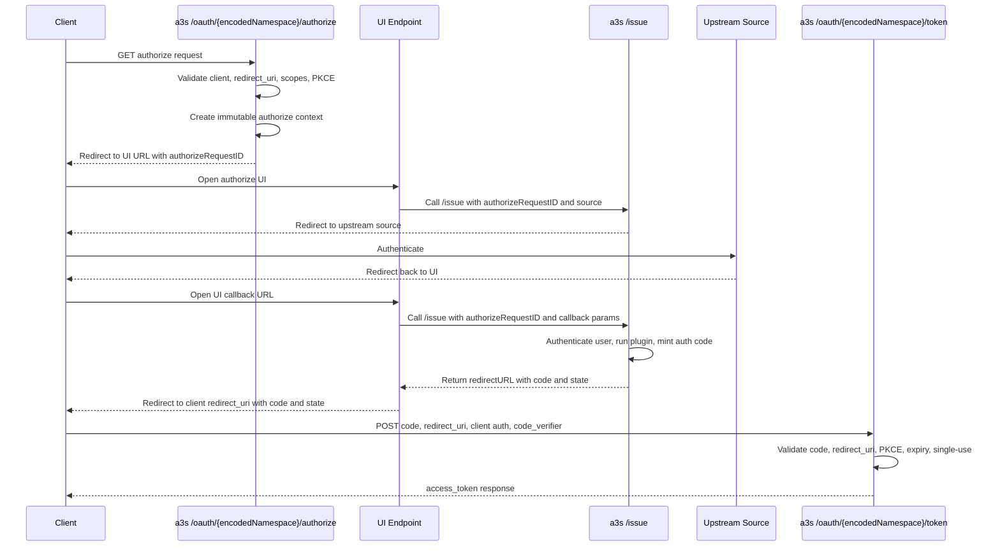

# OAuth Applications Design

## Goal

a3s exposes namespace-scoped OAuth applications so third-party clients can use
a3s as an OAuth 2.0 authorization server for the `authorization_code` grant.

The resulting access token is a standard a3s token.

## Scope

This design is based on:

- the current a3s codebase and its existing `/issue` browser ceremony
- RFC 6749 authorization code flow requirements
- PKCE support for code exchange

## OAuth Engine

a3s implements the OAuth authorization-code flow directly in
`internal/oauthserver`.

The browser flow, `/issue` integration, auth-code session persistence, PKCE
checks, and final a3s token issuance all remain in a3s.

Responsibilities of the OAuth engine:

- validate authorize requests
- validate token requests
- enforce client authentication rules
- enforce redirect URI binding
- enforce PKCE rules
- issue and redeem authorization codes
- expose a small a3s-oriented API to the HTTP layer and `/issue`

## High-Level Architecture

The feature has three layers:

1. `oauthapplication` namespace-scoped configuration object
2. custom OAuth route handlers for authorize/token and related endpoints
3. integration with the existing `/issue` flow for source-driven
   authentication

`/issue` remains the authentication ceremony engine.

OAuth-specific logic remains in the OAuth layer, except that `/issue` may
mint an authorization code instead of an a3s token when invoked with an
authorization context.

## Routes

Routes:

- `GET /oauth/{encodedNamespace}/authorize`
- `POST /oauth/{encodedNamespace}/token`
- `GET|POST /oauth/{encodedNamespace}/userinfo`
- `GET /.well-known/oauth-authorization-server/oauth`
- `GET /.well-known/oauth-authorization-server/oauth/{encodedNamespace}`
- `GET /.well-known/openid-configuration/oauth`
- `GET /.well-known/openid-configuration/oauth/{encodedNamespace}`
- `GET /oauth/.well-known/openid-configuration`
- `GET /oauth/{encodedNamespace}/.well-known/openid-configuration`

`encodedNamespace` is a reversible slash-free encoding of the namespace so
it fits in a single path segment - using base64 without padding.

For the root namespace `/`, routes keep dedicated short aliases.

Canonical examples:

- root namespace authorize: `/oauth/authorize`
- root namespace token: `/oauth/token`
- root namespace userinfo: `/oauth/userinfo`
- non-root namespace authorize: `/oauth/{encodedNamespace}/authorize`
- non-root namespace token: `/oauth/{encodedNamespace}/token`
- non-root namespace userinfo: `/oauth/{encodedNamespace}/userinfo`

The existing `/.well-known/jwks.json` route continues to be used for key
distribution.

## Issuer Model

To preserve compatibility with RFC 8414 discovery in a path-based multi-tenant
deployment, each namespace-scoped OAuth surface has its own issuer.

Canonical issuer examples:

- root namespace issuer: `https://host/oauth`
- non-root namespace issuer: `https://host/oauth/{encodedNamespace}`

The RFC 8414 metadata URL is derived by inserting
`/.well-known/oauth-authorization-server` before the issuer path.

Examples:

- root metadata URL:
  `https://host/.well-known/oauth-authorization-server/oauth`
- non-root metadata URL:
  `https://host/.well-known/oauth-authorization-server/oauth/{encodedNamespace}`

The metadata response `issuer` value exactly matches the issuer used to
derive the metadata URL.

## OpenID Configuration Discovery

Many OAuth clients only know the OpenID Connect discovery location. To stay
usable by those clients, the same metadata is also served as an OpenID
Provider configuration document, at both discovery locations in use in the
wild:

- OpenID Connect Discovery 1.0 appends the well-known path to the issuer:
  - `https://host/oauth/.well-known/openid-configuration`
  - `https://host/oauth/{encodedNamespace}/.well-known/openid-configuration`
- RFC 8414 section 5 inserts it before the issuer path:
  - `https://host/.well-known/openid-configuration/oauth`
  - `https://host/.well-known/openid-configuration/oauth/{encodedNamespace}`

The document is the RFC 8414 authorization server metadata of the same
namespace, plus the fields OpenID Connect requires:

- `userinfo_endpoint`: the userinfo endpoint of the same namespace
- `subject_types_supported`: always `["public"]`, since a3s subjects are not
  pairwise per client
- `id_token_signing_alg_values_supported`: always `["ES256"]`, the algorithm
  the a3s token machinery signs with

a3s implements the OpenID Connect code flow: an authentication request, meaning
one whose scopes include `openid`, is answered with an ID Token beside the
access token, and `userinfo` serves the claims behind an access token. A client
that speaks only OIDC can therefore use a3s.

An `oauthclient` with an empty `scopes` list accepts any scope it is asked for.
One that lists scopes must include `openid`, or have it in the
`oauthapplication` `defaultScopes` when the client requests none, since a
request naming an unlisted scope is refused with `invalid_scope` rather than
reduced. The metadata advertises no `scopes_supported`, so a client cannot
discover either rule.

Conformance stops short of the whole specification. a3s does not implement:

- `max_age` or `prompt`, and no `auth_time` to support them. A source
  stringifies every claim it copies, and OIDC Core section 2 types `auth_time`
  as a number, so passing an upstream one through would make a relying party
  reject the whole token
- `acr` and `amr`, in the sense that a3s never derives them. It does forward
  the ones a source provides, so a relying party may see the authentication
  context of the upstream login. Nothing in a3s requires, checks or enforces
  those values, and `acr_values` on a request is ignored
- request objects, the `claims` request parameter, or `display` and `ui_locales`
- ID Token encryption, signed userinfo responses, or algorithms besides ES256
- session management, front-channel or back-channel logout
- pairwise subject identifiers. a3s advertises `public`, so every client sees
  the same `sub` for a given user, as described under [Subject](#subject)
- typed claims. A source flattens every claim it copies into a string, so
  `email_verified` is `"true"` rather than `true` and `updated_at` is a string
  rather than a number, where OIDC Core section 5.1 types them as a boolean and
  a number. A relying party deserializing the standard claims into typed fields
  will fail on them

A deployment needing any of those should not treat a3s as a drop-in OpenID
Provider.

## Userinfo Endpoint

`userinfo` returns the identity claims carried by an access token this
namespace's OAuth surface issued. It follows
[OpenID Connect Core section 5.3](https://openid.net/specs/openid-connect-core-1_0.html#UserInfo),
accepting `GET` or `POST` with the access token presented as an RFC 6750
bearer credential.

Only OAuth access tokens are served. The token must have been issued by this
namespace's OAuth surface and must name an `oauthapplication`. A native a3s
token is refused even though a3s signed it, which is a deliberate difference
from the token exchange: the exchange accepts native a3s tokens as subject
tokens, while the OIDC surface describes the OAuth surface, so it serves only
tokens a client obtained through an `oauthapplication` with that application's
policy applied.

The endpoint validates the token signature, the issuer, and the expiration,
and refuses refresh tokens. It deliberately does less than the token exchange
does with its subject token:

- the `oauthapplication` is not re-resolved
- the audience is not checked

An exchange mints fresh evidence addressed to a third party, so it must
confirm the application still exists and still owns the token. `userinfo` only
restates claims the caller already holds inside the token it presented, so the
signature and expiration are the whole authority, and the endpoint needs no
database read.

For the same reason `userinfo` applies no scope check.

The access token is only ever read from the `Authorization` header. Unlike the
rest of a3s, this endpoint does not fall back to the `x-a3s-token` cookie: a
cookie is attached by the browser rather than chosen by the caller, and an
OAuth protected resource must authenticate the access token its client was
issued, not an ambient session.

### Claims

The response projects the token identity claims into a flat JSON object. The
same projection builds the ID Token, so both describe an identity the same way:

- derived `@` claims are left out. They describe how a3s reached the identity,
  not the identity
- the claims a3s sets itself are left out too, along with the ones binding the
  upstream token to its own client, access token or session: `iss`, `aud`,
  `exp`, `nbf`, `iat`, `jti`, `nonce`, `azp`, `at_hash`, `c_hash` and `sid`. A
  source copies its whole claim set into the identity, so these would otherwise
  read as if they described this token. That is not cosmetic: a relying party
  checks `azp` against its own client id and `at_hash` against the access token
  a3s issued, and rejects the token when the upstream values disagree
- `auth_time` goes with them, for the reason given in the conformance list
  above: the value a source carries is a string, and a relying party rejects
  the token over it
- `sub` goes with them: a3s sets the subject itself, as described under
  [Subject](#subject)
- everything else a source carries is kept, including `acr` and `amr`, which
  arrive correctly typed and describe the upstream login rather than binding
  its token. A relying party reading them is reading the source's word for how
  the user authenticated, which a3s forwards without checking
- a claim the source repeats becomes an array, since a3s carries multi-valued
  claims such as groups as repeated entries
- every other claim is a string

### Subject

A relying party identifies a user by the `iss` and `sub` pair, and keys its
local account on it permanently. `iss` here is the namespace, identical for
every source in it, so a subject must be unique across every source that
namespace holds: two sources naming one subject for two different people would
be merged into a single account, with nothing in the flow detecting it.

a3s therefore derives the subject, when the identity is authenticated through
an `oauthapplication`, by hashing the source that authenticated it together
with the value of the claim that source nominates:

```
sub = base64url(sha256("a3s/oidc-sub/v1" || type || namespace || name || value))
```

Each field is length prefixed, so a source named `a` holding the value `b/c`
cannot collide with a source named `a/b` holding `c`. Every source in a
namespace gets its own subject space, which is what keeps a subject unique
across the namespace. The result is 43 characters, inside the 255 ASCII the
[OIDC Core section 2](https://openid.net/specs/openid-connect-core-1_0.html#IDToken)
`sub` claim allows.

The hash holds no secret. a3s keeps no identity state, so a salt would be a
value that could never be rotated or lost without orphaning every account at
every relying party. OIDC Core section 8 asks a `public` subject type to be
unique and never reassigned, not unguessable.

The subject is derived once, when the identity is authenticated, and carried
from then on as the `sub` of the access token. An a3s token renewed from
another therefore keeps the subject the original was minted with.

#### subClaim

Which claim names the subject is per source, through its `subClaim` field:

| Source | Default `subClaim` |
| --- | --- |
| `oidcsource` | `sub`, the subject the upstream named |
| `samlsource` | `nameid`, the assertion `NameID` |
| every other source | none: the operator has to nominate one |

An LDAP, MTLS, HTTP, OAuth2 or A3S source authenticates a subject it does not
name by convention, so `subClaim` has to be set before it can serve an OpenID
Connect request. Nominate a claim whose value the source never reassigns:
`entryuuid` rather than `dn` for LDAP, `serialnumber` for MTLS. A reassigned
value hands a new person an existing account, and a value that changes between
logins silently orphans one.

An identity whose `subClaim` resolves to nothing carries no subject, and a3s
refuses to answer an OpenID Connect request with it, rather than issuing an ID
Token or a userinfo response no relying party could accept. Only the OpenID
Connect surface refuses: such a source still authenticates, and still gets an
access token, one simply carrying no `sub`.

Changing `subClaim` on a live source changes the subject of everyone who
authenticates through it afterwards, and relying parties will treat them as new
users. Tokens already issued keep the subject they were minted with.

## UI Model

a3s provides a reference UI implementation for the OAuth authorize flow.

That reference UI currently handles:

- collecting source type, source namespace, and source name from the user
- forwarding the authorize context into `/issue`
- receiving the upstream source callback
- calling `/issue` again with callback data and the same authorize context

a3s also supports a configuration option that points to an
external UI endpoint implementing the same browser contract.

The authorize handler builds a UI redirect URL using:

- a local built-in UI endpoint by default
- a configured external UI base endpoint when provided

The backend does not depend on implementation details of the bundled UI.

## Data Model

The design uses two related concepts:

- `oauthapplication`: rich, namespace-scoped app behavior and policy object
- OAuth client registration record: client-specific OAuth metadata stored in a
  separate persistence layer or collection and linked to an
  `oauthapplication`

`oauthapplication` remains the primary admin-managed object in a3s.

Client-specific parameters should not be hardcoded into the application object
for DCR-created clients.

Instead, registered clients reference an `oauthapplication` and carry their own
OAuth client metadata.

## oauthapplication Object

`oauthapplication` is a namespace-scoped object managed through normal a3s CRUD
and import flows.

Minimal intended fields:

- `name`
- `description`
- `namespace`
- `disabled`
- `audience`
- `allowedSources`
- `defaultScopes`

Notes:

- `oauthapplication` defines app behavior, not per-client registration data
- multiple registered clients may reference the same `oauthapplication`

`allowedSources` determines login source selection behavior:

- if `allowedSources` is absent or null, any supported interactive source in
  the namespace is allowed
- if `allowedSources` is present, the selected source matches one of the
  listed Elemental filter expressions evaluated against the resolved source
  object, for example `namespace == /my/ns and name == corp`
- each `allowedSources` entry must parse as a valid `elemental.Filter` at
  object validation time

A single fixed source is represented as an `allowedSources` list of length one.

## OAuth Client Registration Record

Each concrete OAuth client has its own registration record linked to an
`oauthapplication`.

This record contains client-specific OAuth metadata such as:

- `oauthApplicationID`
- `clientID`
- `clientSecret`
- `redirectURIs`
- `scopes`
- `tokenEndpointAuthMethod`
- optional registration metadata for DCR support

Authorize and token processing work as follows:

- `/authorize` loads the client registration by `client_id`
- validates the requested `redirect_uri` against that client's
  `redirectURIs`
- stores the chosen `redirect_uri` in the authorize context
- binds the authorization code to that exact `redirect_uri`
- `/token` requires the same `redirect_uri` when `redirect_uri` was present on
  the authorize request

Notes:

- `clientSecret` is currently compared directly by the OAuth layer
- over `client_secret_basic`, the `clientID` is percent-decoded, since RFC 6749
  section 2.3.1 has the client encode it. That is what lets a `clientID`
  containing a `:` authenticate at all: Basic splits on the first colon, so an
  identifier sent raw is indistinguishable from a shorter identifier with a
  different secret, and a3s rejects it rather than guessing the boundary. A
  value that is not valid percent-encoding is used verbatim, so clients that
  skip the encoding keep working, and `+` is left alone rather than read as an
  encoded space, because it is far more likely to be a byte of a base64 secret
- the `clientSecret` is deliberately *not* decoded, which departs from RFC 6749
  section 2.3.1. Secrets are admin-supplied rather than minted by a3s, so
  decoding one would silently change the meaning of any existing secret holding
  a percent escape, leaving a bare `invalid_client` as the only symptom and the
  same client working over `client_secret_post`. A secret that genuinely needs
  encoding, because it contains a `:` or a space, must use
  `client_secret_post`, where both values are ordinary form fields
- `oauthApplicationID` is `creation_only`
- `clientID` is `creation_only`
- clients and oauth applications always live in the same namespace
- v1 supports only `authorization_code`
- v1 supports only `response_type=code`
- the protocol layer supports `client_secret_basic`, `client_secret_post`, and
  `none`
- clients using `none` are public clients
- clients configured with `ClientSecretBasic` or `ClientSecretPost` are pinned
  to that exact transport for their secret; `ClientSecretAny` requires a
  secret but accepts it via either transport, since a3s has no DCR and
  generic OAuth clients have no way to discover which one a given client is
  pinned to
- because only one grant type and one response type are supported in v1, they
  do not need to be stored per client yet
- for DCR, new clients create registration records, not new `oauthapplication`
  objects

Stored object values:

- `tokenEndpointAuthMethod`: `ClientSecretBasic`, `ClientSecretPost`,
  `ClientSecretAny`, `None`

## Pending Authorize Context

`/authorize` validates the OAuth request and stores a short-lived immutable
authorize context.

The context is a server-side cache object, not an API resource.

It contains:

- `id`
- `namespace`
- `clientID`
- `redirectURI`
- `requestedScopes`
- `state`
- `nonce`
- `codeChallenge`
- `codeChallengeMethod`
- `expiresAt`

The authorize context is intentionally immutable after creation.

It is allowed to be reused within its TTL. Reusing the resulting UI URL may
produce multiple fresh authorization codes. The codes themselves remain
single-use, which is the RFC-relevant property.

This follows the existing a3s pattern used by `internal/oauth2ceremony` and
`internal/samlceremony`.

The authorize context preserves the original client-provided `state` value
and the final redirect returns that exact value when it was supplied.

It preserves the `nonce` the same way, and the authorization code carries it
onward so `/token` can echo it into the ID Token. A relying party rejects an ID
Token whose nonce does not match what it sent, so losing the value anywhere
along that path would break every authentication request that used one.

App configuration such as `allowedSources` is not duplicated into the
authorize context. The client registration and its referenced
`oauthapplication` are loaded again when the flow resumes.

## Source Selection UI

The current implementation always redirects `/authorize` to a UI page instead
of entering `/issue` directly.

The bundled UI carries the immutable authorize context ID, asks the user for
source type, source namespace, and source name, and then calls `/issue`.

No dedicated backend `select-source` endpoint is required.

## Browser Flow

The authorize endpoint follows [RFC 6749 Section 3.1](https://www.rfc-editor.org/rfc/rfc6749.html#section-3.1).

Current flow:

1. Client calls `GET /oauth/{encodedNamespace}/authorize?...`.
2. Server validates OAuth request and app configuration.
3. Server creates an immutable authorize context.
4. Server returns or redirects to a UI URL containing that context ID.
5. UI collects source type, source namespace, and source name.
6. UI calls `/issue` with:
   - `authorizeRequestID`
   - selected source information
   - normal `/issue` source parameters
7. `/issue` redirects to the upstream source as it already does today.
8. Upstream source redirects back to the UI.
9. UI calls `/issue` again with:
   - upstream callback data
   - the same first-class `authorizeRequestID`
10. `/issue` completes authentication and, because authorization context is
    present, completes the OAuth flow by returning the client
    `redirect_uri` with an authorization code to the UI
11. UI redirects the browser to the client `redirect_uri`

### Sequence: Authorize With UI


```mermaid
sequenceDiagram
    participant Client
    participant Authorize as a3s /oauth/{encodedNamespace}/authorize
    participant UI as UI Endpoint
    participant Issue as a3s /issue
    participant Source as Upstream Source
    participant Token as a3s /oauth/{encodedNamespace}/token

    Client->>Authorize: GET authorize request
    Authorize->>Authorize: Validate client, redirect_uri, scopes, PKCE
    Authorize->>Authorize: Create immutable authorize context
    Authorize-->>Client: Redirect to UI URL with authorizeRequestID
    Client->>UI: Open authorize UI
    UI->>Issue: Call /issue with authorizeRequestID and source
    Issue-->>Client: Redirect to upstream source
    Client->>Source: Authenticate
    Source-->>Client: Redirect back to UI
    Client->>UI: Open UI callback URL
    UI->>Issue: Call /issue with authorizeRequestID and callback params
    Issue->>Issue: Authenticate user, run plugin, mint auth code
    Issue-->>UI: Return redirectURL with code and state
    UI-->>Client: Redirect to client redirect_uri with code and state
    Client->>Token: POST code, redirect_uri, client auth, code_verifier
    Token->>Token: Validate code, redirect_uri, PKCE, expiry, single-use
    Token-->>Client: access_token response
```

## Relationship Between /issue and OAuth

Normal `/issue` behavior stays unchanged.

When `/issue` receives `authorizeRequestID`, it enters OAuth-completion mode:

- load the immutable authorize context
- currently allow only MTLS, OIDC, OAuth2, or SAML sources
- validate the selected source against the referenced `oauthapplication`
- complete the normal source-specific authentication flow
- mint an authorization code instead of an a3s access token
- return the client `redirect_uri` with the authorization code and original
  `state` to the UI

`/issue` is therefore allowed to mint authorization codes when authorization
context is present.

For OIDC, OAuth2, and SAML source ceremonies, `/issue` treats
`authorizeRequestID` as a first-class request field. It also persists that
value in the server-side ceremony cache alongside the upstream state value. On
the callback leg, it restores the field onto the resumed `/issue` request
before continuing OAuth completion. That state/relay-state coupling is what
binds the resumed external login ceremony back to the original OAuth authorize
context.

## Authorization Code Model

The authorization code is the frozen result of the authorization decision.

It contains everything needed by `/token` to mint the final a3s token without
rerunning policy logic.

The code payload includes:

- final claims
- source metadata
- namespace
- app identity / client identity
- approved scopes
- audience
- restrictions
- redirect URI binding
- PKCE challenge data
- expiration

The authorization code itself is single-use.

That single-use property is required by RFC 6749 section 4.1.2.

The authorize context is not required by the RFC to be single-use and is
allowed to be reused within TTL.

The code is bound to:

- client identifier
- redirect URI
- PKCE challenge data when present

## Token Endpoint

The token endpoint follows [RFC 6749 Section 3.2](https://www.rfc-editor.org/rfc/rfc6749.html#section-3.2).

`/token`:

1. authenticate the client
2. validate the authorization code
3. validate redirect URI binding
4. validate PKCE if present
5. extract claims and token metadata from the code
6. mint a standard a3s token from that payload
7. mint an ID Token beside it when the granted scopes include `openid`

`/token` is deterministic and does not perform a second authorization
decision.

The token response follows the OAuth 2.0 token response format, carrying
`id_token` as well when step 7 applied.

## Token Shape

The resulting access token is a normal a3s JWT issued through the existing
token machinery.

It is signed by the existing a3s JWKS and validated by the existing a3s
authenticator.

When `/issue` runs in OAuth-completion mode, it injects the resolved OAuth
application into the `IdentityToken` before authorization-code issuance. Those
fields produce these identity claims in the final JWT when `/token` signs the
access token:

- `@oauthapp:id=<oauthApplicationID>`
- `@oauthapp:namespace=<oauthApplicationNamespace>`
- `@oauthapp:name=<oauthApplicationName>`

Those claims are added alongside the existing `@source:*` and `@issuer=*`
claims.

The access token also carries `sub`, the subject described under
[Subject](#subject), as a registered JWT claim rather than an identity claim.
It is set only for tokens minted through an `oauthapplication`, and only when
the source names a subject. a3s does not read it itself: an a3s token names
its bearer through the identity claims, while `sub` names them to a relying
party of the OAuth surface. That is the value
[RFC 9068 section 2.2](https://www.rfc-editor.org/rfc/rfc9068.html#section-2.2)
asks a JWT access token to carry, though a3s does not otherwise follow that
profile and does not type its access tokens `at+jwt`.

## ID Token

An ID Token is a different artifact from an access token that happens to share
a signing key. An access token carries a3s claims in the nested a3s shape and
its audience names the resource it grants access to. An ID Token carries flat
top-level claims and its audience names the party the token is evidence for.

Two paths mint one, through a single signing path:

- the authorization-code grant, when the granted scopes include `openid`. The
  audience is the `clientID`, since the token is evidence for the client that
  authenticated the user
- the RFC 8693 token exchange, always, since issuing one is what that grant is
  for. The audience is the requested `audience`

The claim set is:

- `iss`: the OAuth issuer of the namespace
- `aud`: as above
- `sub`: the subject a3s derives for the source that authenticated the
  identity, as described under [Subject](#subject)
- `exp` and `iat`
- `nonce`: only when the request carried one, which only an authentication
  request does. An exchange never carries one
- every claim from the identity projection described under [Claims](#claims)

The projection drops the claims a3s sets itself, so a source cannot displace
them. That matters because a source copies its whole upstream claim set into
the identity: without it an upstream identity provider could mint a token that
appeared to come from itself, and its ceremony nonce could surface in a token
whose own request carried none.

Nothing a3s-specific crosses over. Restrictions are left behind because an ID
Token is not an authorization credential, and the opaque data is left behind
because it is held for the bearer of the original token rather than for the
party the evidence addresses. Source provenance goes with the rest of the
derived claims, so a relying party cannot tell from an ID Token which source
authenticated the user.

An identity carries no subject when its source nominates no `subClaim`, when
the claim it nominates resolved to nothing, or when the identity was minted
outside an `oauthapplication`, since a3s derives the subject only for the flows
that pass through one. See [Subject](#subject).

The two grants answer that differently. An authentication request is refused:
OIDC Core section 2 makes `sub` required, so the ID Token would be rejected by
the relying party anyway, and failing at the token endpoint says why. An
exchange is not an authentication request. It asserts what its subject token
carried, so it issues the ID Token without a `sub`, and the relying party fails
on the missing claim. That is what lets a native a3s token, which never passes
through an `oauthapplication`, still be exchanged.

The token exchange marks its response `token_type: N_A`, per
[RFC 8693 section 2.2.1](https://www.rfc-editor.org/rfc/rfc8693.html#section-2.2.1),
because an ID Token must never be presented as an access token. `userinfo`
enforces the same rule from the other side: an ID Token is flat, so it does not
parse as an a3s identity token at all and cannot authenticate a userinfo
request.

## Dynamic Client Registration Compatibility

Dynamic Client Registration is deferred for v1, but the current data model
allows it to be added later.

When DCR is added, it should create a client registration record linked to an
existing `oauthapplication`.

For v1 policy compatibility, DCR-created clients would still be constrained to:

- `token_endpoint_auth_method` in
  `client_secret_basic`, `client_secret_post`, or `none`
- `authorization_code` grant only
- `response_type=code` only

Those values are currently fixed by server policy and therefore do not need to
be stored per client in v1.

## Client ID Metadata Documents

Client ID Metadata Documents are deferred for v1.

This mechanism is distinct from Dynamic Client Registration.

In the MCP authorization model, a client may use an HTTPS URL as its
`client_id`, where that URL points to a JSON metadata document describing the
client. When the authorization server advertises
`client_id_metadata_document_supported=true`, MCP clients may use this
mechanism instead of DCR.

Example client metadata document URL:

- `https://vscode.dev/oauth/client-metadata.json`

Relevant specifications:

- MCP Authorization specification
- OAuth Client ID Metadata Documents draft
- OAuth 2.0 Authorization Server Metadata (RFC 8414) for advertising
  `client_id_metadata_document_supported`

If a3s adds support later, the behavior should be:

- accept URL-form `client_id` values over HTTPS
- fetch the metadata document from the `client_id` URL without using client
  credentials
- validate that the fetched document's `client_id` exactly matches the URL
- require the metadata document to contain at least:
  - `client_id`
  - `client_name`
  - `redirect_uris`
- validate authorization request `redirect_uri` values against the fetched
  metadata document
- cache fetched documents according to normal HTTP cache behavior

This mechanism would reduce the need for persisted client registration records
for some MCP clients, but it should not replace the internal
`oauthapplication` object.

If implemented, it should coexist with the existing models as follows:

- `oauthapplication` remains the app behavior and policy object
- client registration records remain the normal persisted client model
- Client ID Metadata Documents become an additional client identification and
  metadata source for compatible clients

Because a3s uses namespace-scoped OAuth surfaces, a later implementation must
also define how URL-based `client_id` values are bound to a namespace and how
they select or reference an `oauthapplication`.

## Deferred Features

Explicitly deferred for v1 unless later required:

- Dynamic Client Registration
- Client ID Metadata Documents
- refresh tokens
- introspection
- the parts of OpenID Connect listed under
  [OpenID Configuration Discovery](#openid-configuration-discovery), chiefly
  `max_age` and `prompt`, deriving the authentication-context claims, request
  objects, session management and logout
